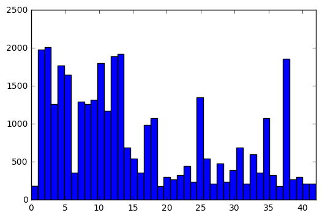
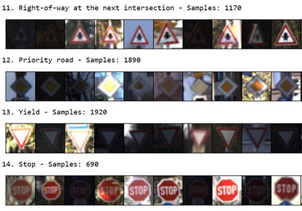
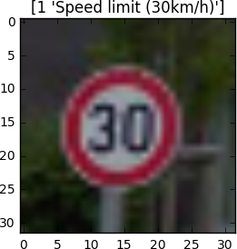
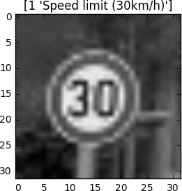
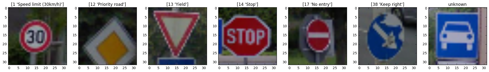
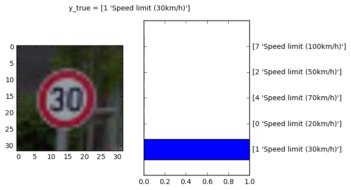
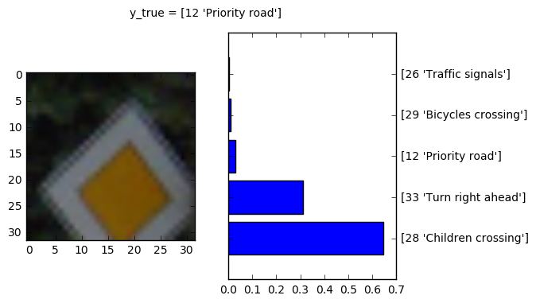
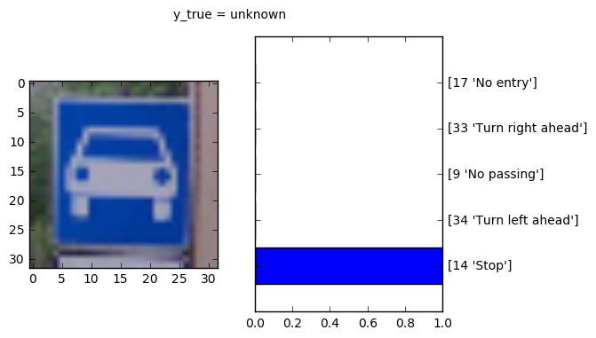

# Traffic Sign Classifier [](http://www.udacity.com/drive)

This is my solution of Project 2 of Udacity's Self Driving Car Nanodegree.  

### Goals & steps of the project
* Load the data set (see below for links to the project data set)
* Explore, summarize and visualize the data set
* Design, train and test a model architecture
* Use the model to make predictions on new images
* Analyze the softmax probabilities of the new images
* Summarize the results with a written report

### Jupyter Notebook

* Source Code: [Traffic_Sign_Classifier.ipynb](./Traffic_Sign_Classifier.ipynb)

### Basic summary of the data set

* Download dataset: [traffic-signs-data.zip](https://d17h27t6h515a5.cloudfront.net/topher/2017/February/5898cd6f_traffic-signs-data/traffic-signs-data.zip)
* The size of training set is 34799
* The size of validation set is 4410
* The size of test set is 12630
* The shape of a traffic sign image is (32, 32, 3)
* The number of unique classes/labels in the data set is 43

### Exploratory visualization on the data set

The bar chart shows the data distribution of the training data. Each bar represents one class (traffic sign) and how many samples are in the class. The mapping of traffic sign names to class id can be found here: [signnames.csv](./signnames.csv)



Here are some traffic signs from the training data set. More can be found in the jupyter notebook.



### Design and Test a Model Architecture

#### Preprocessing

The images of the training dataset have 3 color channels. I reduced the channels to only one. I converted the images to YCrCb color space and use the y-channel. Here you can see how it looks like:

|original image|preprocessed image
|----|----|
|||

The main reason why I reduced to one channel is because of reducing the amount of input data, training the model is significantly faster. The color of traffic signs should not be importent for classification. They are designed that even color blind people can identify them.

I normalized the data before training for mathematical reasons. Normalized data can make the training faster and reduce the chance of getting stuck in local optima.

#### Model Architecture
 
 I use a convolutional neuronal network to classify the traffic signs. The input of the network is an 32x32x1 image and the output is the probabilty of each of the 43 possible traffic signs.
 
 My final model consisted of the following layers:

| Layer         		|     Description	        					| Input |Output| 
|:---------------------:|:---------------------------------------------:| :----:|:-----:|
| Convolution 5x5     	| 1x1 stride, valid padding, RELU activation 	|**32x32x1**|28x28x48|
| Max pooling			| 2x2 stride, 2x2 window						|28x28x48|14x14x48|
| Convolution 5x5 	    | 1x1 stride, valid padding, RELU activation 	|14x14x48|10x10x96|
| Max pooling			| 2x2 stride, 2x2 window	   					|10x10x96|5x5x96|
| Convolution 3x3 		| 1x1 stride, valid padding, RELU activation    |5x5x96|3x3x172|
| Max pooling			| 1x1 stride, 2x2 window        				|3x3x172|2x2x172|
| Flatten				| 3 dimensions -> 1 dimension					|2x2x172| 688|
| Fully Connected | connect every neuron from layer above			|688|84|
| Fully Connected | output = number of traffic signs in data set	|84|**43**|

#### Model Training

I trained the model on my local machine with a GPU (NVIDA GeForce GT 750 M). It is not a high-end gpu, but it has a compute capability of 3.0, which is the absolute minimum requirement of tensorflows gpu support. Compared to my cpu, the training was about 3.3 times faster.

**NOTE:** If you are on windows and get an CUDA_ERROR_ILLEGAL_ADDRESS in gpu mode, it is probably an issue with ```tf.one_hot()``` Have a look: https://github.com/tensorflow/tensorflow/issues/6509 That is the reason why I use the function ```one_hot_workaround``` in my code.

Here are my final training parameters:
* EPOCHS = 35
* BATCH_SIZE = 128
* SIGMA = 0.1
* OPIMIZER: AdamOptimizer (learning rate = 0.001)

My results after training the model:
* Validation Accuracy = **97.1%**
* Test Accuracy = **95.4%**

#### Solution Approach

My first implementation was LeNet-5 shown in the udacity classroom. I modified it to work with the input shape of 32x32x3. It was a good starting point and I get a validation accuracy of about 90%, but the test accuracy was much lower (about 81%). So I modified the network and added more convolutional layer, did some preprocessing and looked which changes give better results. You can see my final model architecture above. I experiment with dropout as well, but I couldn't see any improvements. Training for more than 35 epochs do not increase the validation accuracy. I trained the network for 50 and more epochs, but I get a slightly decreasing accuracy. So I decided to stop training after 35 epochs.

### Test on new images

#### Acquiring New Images

I used google street view to get new images for my testing set. Here are 7 examples I collected. 6 traffic signs that are in the dataset and, just for fun, one that is not.



The signs "speed limit 30", "yield, stop", "no entry" and "keep right" should be easy to detect, because they are clearly visible and there are lots of examples in the training set. The "priority road" sign should be a little bit tricky, because there are only parts of the sign visible. The last sign is just to see what the model predict.

#### Performance on New Images

| Image			        |     Prediction		| 
|:---------------------:|:---------------------:| 
| Speed limit (30km/h)  | Speed limit (30km/h)  | 
| Priority road   		| Children crossing 	|
| Yield			| Yield					|
| Stop		| Stop					|
| No entry		| No entry  |
| Keep right | Keep right |
| *Unknown* | *Stop* |

5 of 6 correct = **83.3 %** (*5 of 7 correct = 71,42 %*)

If you look at the 6 new images, 5 of them are correct. That's an accuracy of 83.3 %, which is much lower than the accuracy of the test set (95.4 %), but with such a small set of images you can not calculate a good accuracy. You need more images.

#### Softmax Probabilities

**Prediction correct**

Everything good here, very confident with its prediction.



**Prediction false**

The priority road sign, correct solution is on the third place with less than 5 %



**Prediction unknown**

What happens when the sign is not in training set? Yes, it picks a sign that look very similar, or? 



This could be dangerous. As you see, it is realy confident with its prediction. In this case the car will stop, but what happens when it predicts a priority road sign instead? So this model should be improved and trained with all the other traffic signs that exist in the world, before you can use it in a real car ;)

### Resources
* Source code: [Traffic_Sign_Classifier.ipynb](./Traffic_Sign_Classifier.ipynb)
* Pickle files: [traffic-signs-data.zip](https://d17h27t6h515a5.cloudfront.net/topher/2017/February/5898cd6f_traffic-signs-data/traffic-signs-data.zip)
* Original data set: [German Traffic Sign Data Set](http://benchmark.ini.rub.de/?section=gtsrb&subsection=dataset)
* LeNet-5: [Gradient-Based Learning Applied to Document Recognition](http://yann.lecun.com/exdb/publis/pdf/lecun-01a.pdf)
* Project specification: [Udacity Rubrics](https://review.udacity.com/#!/rubrics/481/view)
* Udacity repository: [CarND-Traffic-Sign-Classifier-Project](https://github.com/udacity/CarND-Traffic-Sign-Classifier-Project)
* [Udacity Self Driving Nanodegree](http://www.udacity.com/drive)